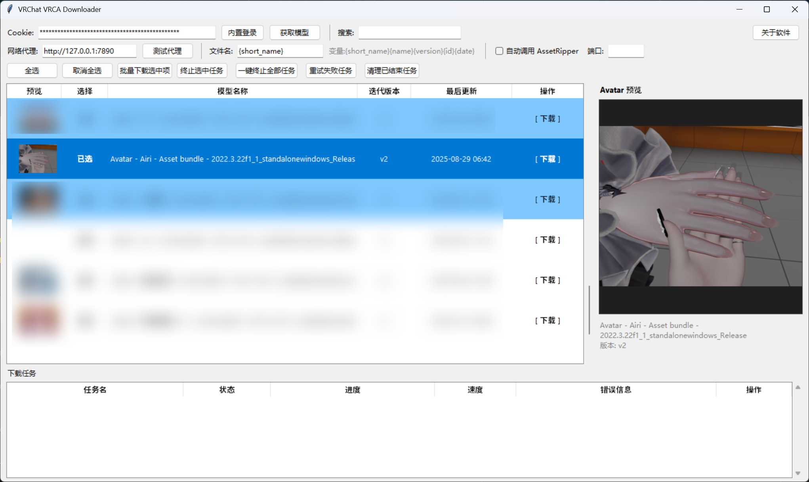

# VRChat VRCA Downloader

**VRChat VRCA Downloader** 是用于下载本人 VRChat 账号下 Avatar `.vrca` 文件的桌面工具。  
通过 VRChat 官方 API 获取模型列表，不保存账号密码。

  

## 当前功能

- 账号访问
  - 支持手动粘贴 `auth` Cookie
  - 支持内置登录页自动抓取 `auth` Cookie
- 模型列表
  - 一键同步账号模型
  - 搜索过滤
  - 右侧 Avatar 预览图与名称信息
  - 多选下载（选择列 + 全选/取消全选）
- 下载任务管理
  - 多任务并发下载
  - 总体进度与实时速度显示
  - 智能超时自动终止（无进度自动判定）
  - 失败/超时/终止任务一键重试
  - 终止选中任务 / 一键终止全部任务 / 单任务点击终止
  - 清理已结束任务
- 文件名与网络
  - 文件名模板变量：`{short_name}{name}{version}{id}{date}`
  - 默认模板为 `{short_name}`（更简洁）
  - 支持 HTTP/HTTPS 代理与代理连通性测试
- 缓存与退出
  - 头像图本地缓存提升预览速度
  - 程序关闭时自动清理 `cache/` 目录
- 可选联动
  - 下载完成后可自动调用 AssetRipper 进行导出（需本机已运行）

## 使用方法

1. 运行 `build/vrchat_vrca_downloader.exe`。
2. 获取登录态（任选其一）：
   - 在 `Cookie:` 输入框手动粘贴 `auth=...;`
   - 点击 `内置登录`，登录后等待自动填入 `auth`
3. 点击 `获取模型` 同步列表。
4. 选择模型并下载：
   - 双击单行可单独下载
   - 使用 `选择` 列 + `全选/取消全选` 后点击 `批量下载选中项`
5. 在下方 `下载任务` 区域管理任务状态与终止/重试。

## AssetRipper（可选）

- 启用 `自动调用 AssetRipper` 前，请先安装并运行 [AssetRipper](https://github.com/AssetRipper/AssetRipper/releases)。
- 将 AssetRipper 服务端口填入工具中的端口输入框。

## VRC 交流群

- `1047423396`

## 免责声明

**本工具为第三方辅助工具，仅用于个人账号资产管理与下载。**  
**所有数据请求均通过 VRChat 官方公开 API 完成。**

- 不提供或支持任何破解、绕过权限或非法访问行为
- 不包含对 VRChat 客户端/服务器/资源的注入或篡改
- 不存储、不上传、不分享用户账号密码或 Cookie
